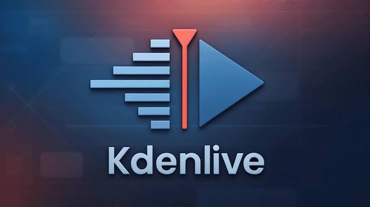

# 📃 Kdenlive Overview 2026

An overview guide to **Kdenlive 2026** — a free and open-source video editor for creating, editing, and exporting professional-looking videos with multitrack timelines, effects, transitions, subtitles, audio tools, color workflows, and flexible project layouts.

---

---

## 📌 What is Kdenlive?

**Kdenlive** is a free and open-source non-linear video editor developed by the KDE community.

It provides a complete editing environment with a **multitrack timeline, video and audio effects, transitions, titles, subtitles, color tools, proxy editing, and flexible workspaces**. Kdenlive works on Windows, macOS, Linux, and BSD. KKdenlive 26.04 Manual+1

---

## 📥 Installation Guide

1. **[⬇️ Download](https://share.google/bFyOivOsCEGWSSn1s)** Kdenlive for Windows, macOS, or Linux.
2. Run the installer or use the recommended standalone package for your platform.
3. Launch Kdenlive and create a new project.
4. Import your video, image, and audio files.
5. Add clips to the timeline and begin editing.
6. Apply effects, transitions, titles, and subtitles.
7. Render the finished project to your preferred video format.

Official documentation provides installation instructions and platform-specific options for Windows, Linux, and macOS. KKdenlive 26.04 Manual+1

---

## ✨ Key Features

| Feature | Description |
|---|---|
| **🎬 Multitrack Editing** | Work with multiple video and audio tracks on a flexible timeline |
| **✂️ Timeline Editing** | Cut, trim, move, split, and arrange clips with precision |
| **🎨 Effects & Filters** | Apply video and audio effects, filters, and adjustments |
| **🔀 Transitions** | Add transitions and compositions between clips |
| **📝 Titles & Subtitles** | Create titles, credits, captions, and subtitles |
| **🎙️ Speech-to-Text** | Generate subtitles using supported speech recognition tools |
| **🎨 Color Correction** | Use scopes and color tools for visual adjustments |
| **🎧 Audio Editing** | Mix audio tracks and control volume, effects, and channels |
| **⚡ Proxy Editing** | Use lower-resolution proxies for smoother editing of demanding footage |
| **📹 Multi-cam Editing** | Work with multiple camera angles in the same project |
| **🧩 Customizable Interface** | Adapt workspaces, panels, shortcuts, and layouts |
| **🌐 Wide Format Support** | Work with many video, audio, image, and codec formats |

Kdenlive supports multitrack editing, effects, transitions, proxy workflows, customizable layouts, scopes, subtitles, and a wide range of media formats. KKdenlive 26.04 Manual+1

---

## 🖥️ Platform Support

| Platform | Availability |
|---|---|
| **🪟 Windows** | 64-bit versions with installer and standalone options |
| **🍎 macOS** | Available for supported macOS systems |
| **🐧 Linux** | Official AppImage and Flatpak packages |
| **💻 BSD** | Supported through portable components |

Kdenlive officially supports Windows, macOS, Linux, and BSD, with platform-specific installation methods documented by the project. KKdenlive+1

---

## 📤 Export & Rendering

Kdenlive uses FFmpeg-based media support and can export projects to a wide range of formats.

- **🎞️ MP4**
- **📦 Matroska**
- **🎥 H.264 / H.265**
- **🍎 Apple ProRes**
- **🎧 AAC / MP3**
- **🖼️ Image sequences**
- **✨ Animated GIF**
- **📺 HD & UHD / 4K**

The editor can work with a broad range of formats and export to formats supported by FFmpeg. KKdenlive 26.04 Manual

---

## 💰 Pricing & Plans

| Plan | What's Included |
|---|---|
| **🆓 Kdenlive (Free & Open Source)** | Full-featured video editing software with no paid subscription required |
| **🏠 Local Use** | Run Kdenlive directly on your own computer |
| **💻 Professional Projects** | Use the editor for personal, educational, and professional video production |

---

## 🔐 License

**Kdenlive is free and open-source software released under the GPL.**

The project is developed as part of the KDE ecosystem and is built around open-source technologies including Qt, MLT, and FFmpeg. KKdenlive 26.04 Manual+1

---

---

**Keywords:** Kdenlive guide, Kdenlive 2026, Kdenlive overview, Kdenlive actually, Kdenlive download, Kdenlive Windows, Kdenlive macOS, Kdenlive Linux, Kdenlive video editor, Kdenlive tutorial, Kdenlive video editing, Kdenlive free video editor, Kdenlive open source, Kdenlive editing software, Kdenlive multitrack editor, Kdenlive effects, Kdenlive transitions, Kdenlive subtitles, Kdenlive audio editing, Kdenlive color correction, Kdenlive 4K editing, Kdenlive FFmpeg, open-source video editor, free video editing software, professional video editor, Linux video editor, Windows video editor, macOS video editor
